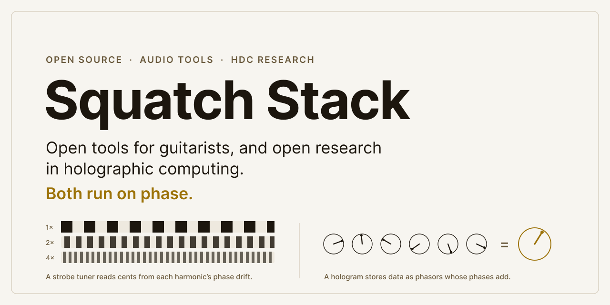
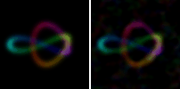
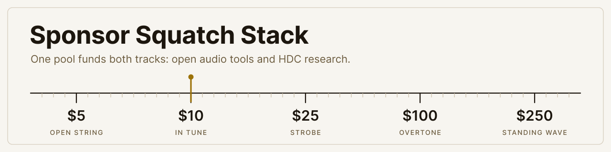

  <picture>
    <source media="(prefers-color-scheme: dark)" srcset="assets/banner-dark.svg">
    
  </picture>

**Open tools for guitarists, and open research in holographic computing.**
A strobe tuner reads a string by watching the phase of each harmonic drift. A
hologram stores data as unit phasors whose phases add. Squatch Stack follows
that one idea in two directions, in the open, and measures before it claims.

### [Try the Squatch Tuner in your browser &rarr;](https://squatch-stack.github.io/squatch-tuner/)

A software strobe that reads a string to a tenth of a cent. Free, MIT, and
the [core](https://github.com/squatch-stack/squatch-tuner) is one folder of C++ headers,
also the first block of [squatch-dsp](https://github.com/squatch-stack/squatch-dsp).

---

## Audio: tools for players

| Repository | What it does |
|---|---|
| **[squatch-tuner](https://github.com/squatch-stack/squatch-tuner)** C++17 · MIT | A guitar and bass tuner built as a software strobe. Header-only, no dependencies, and it never allocates or locks in the audio path. It runs in the browser and on a Raspberry Pi, and is written for microcontrollers too. Re-pitch real guitar DI by exactly 7 cents and it measures the shift with a median error of 0.005 c and a 95th percentile of 0.13 c (MPM: 0.041 and 0.25). `make results` reproduces every number. |
| **[squatch-dsp](https://github.com/squatch-stack/squatch-dsp)** C++17 · MIT | The open C++ sound engine that Squatch tools share. Each block is written once and each target gets a thin host: today JACK on a Raspberry Pi and WebAssembly in the browser. The tuner is its first block, alongside a lookahead limiter, a gate and an EQ. Its tests prove that no block allocates or locks in the audio path, and check each block against a reference render. |
| **[NeuralAmpModelerCore](https://github.com/squatch-stack/NeuralAmpModelerCore)** fork · C++ · MIT | [Neural Amp Modeler](https://github.com/sdatkinson/neural-amp-modeler) is the open way guitarists capture amps and pedals. Our fork of its C++ core, for running NAM well on small hardware like the Raspberry Pi 5. |

## HDC: holographic computing research

| Repository | What it does |
|---|---|
| **[hdc-holo](https://github.com/squatch-stack/hdc-holo)** Python · Apache-2.0 · `pip install hdc-holo` | Data structures, Gaussian-splat scenes, learning, rendering and CRDT sync, superposed in complex FHRR hypervectors. A lookup is an inner product, and capacity is a signal-to-noise budget. v0.3.0 is on PyPI, with a [Zenodo DOI](https://doi.org/10.5281/zenodo.22116367). |
| **[posekit](https://github.com/squatch-stack/posekit)** Swift · Apache-2.0 | Camera poses from Apple's photogrammetry, for splat trainers. It writes nerfstudio and COLMAP formats on Apple silicon, with no CUDA. |

  
   <i>A whole colored 3-D scene orbited from one 768 KB complex vector.
  No geometry exists at render time.</i>

- **Measured, not claimed.** Every technique ships with its capacity law,
  ground-truth figures, deterministic tests and the negative results.
- **Honest about the limits.** As a storage format, a hologram is about 400&times;
  larger than SPZ, and the README says so before anything else.
- **Collaborative by algebra.** CRDT sync over Loro: two processes co-paint
  one scene over TCP and converge bit-for-bit.

---

## Support the work

<picture>
  <source media="(prefers-color-scheme: dark)" srcset="assets/tier-header-dark.svg">
  
</picture>

Everything here is free and open source. Sponsorship buys the two things open
work runs short of: time to finish, and hardware to test on. One pool funds
both tracks.

| Where | Best for |
|---|---|
| **[GitHub Sponsors](https://github.com/sponsors/squatch-stack)** | Monthly or one-time. GitHub takes no fee on sponsorships from personal accounts. |
| **Open Collective** (coming soon) <!-- https://opencollective.com/OPEN_COLLECTIVE_SLUG --> | Companies that want a public ledger of every expense. |
| **Patreon** (coming soon) <!-- https://www.patreon.com/PATREON_HANDLE --> | A monthly build log with demos, and skin packs once the skin format opens. |
| **[Ko-fi](https://ko-fi.com/squatchstack)** | A one-off tip, any amount. |
| **Buy Me a Coffee** (coming soon) <!-- https://www.buymeacoffee.com/BMAC_HANDLE --> | A coffee from the tuner page. |

### Sponsors

Nobody yet. Be the first: your name goes here and in the next release notes.

---

Squatch Stack is the build account of [Squatch CC](https://squatch.cc), a
software studio.
