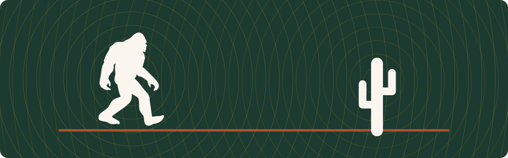

  

<h1 align="center">Squatch Stack</h1>

<b>Software that finds harmony, shipped.</b> 
The build account of <a href="https://squatch.cc">Squatch CC</a>, a
software &amp; app studio in the Tucson desert — local-first software,
hard problems, the right answer rather than the popular one.

---

## Now building

### [holo](https://github.com/squatch-stack/hdc-holo) — holographic computing on FHRR hypervectors

Data structures, Gaussian-splat scenes, learning, rendering, and CRDT
replication — superposed in bundles of complex phasors, where a lookup
is an inner product and capacity is a signal-to-noise budget.

  
   <i>a whole colored 3-D scene orbited from ONE 768 KB complex
  vector — no geometry exists at render time</i>

- **Measured, not claimed** — every technique ships with its capacity
  law, ground-truth figures, deterministic tests, and the honest
  negative results.
- **Real captures** — a 519k-splat desert scan encoded, queried,
  fitted, and orbited from holographic cell bundles on Apple silicon.
- **Collaborative by algebra** — CRDT sync over Loro with
  conflict-free undo: two processes co-paint one scene over TCP and
  converge bit-for-bit.

FSL-1.1 · every release converts to Apache-2.0 after two years ·
[roadmap](https://github.com/squatch-stack/hdc-holo/blob/main/ROADMAP.md)

### SquatchFlow — coming to the stack

A macOS app from the studio bench, joining this account when it's
ready to meet people.

---

## Elsewhere

[squatch.cc](https://squatch.cc) — the studio

<i>Every mark in the family is the same interference field with a
different canon silhouette — the sasquatch for the studio, the saguaro
for holo. In the duet mark above, they are the field's two sources:
two signals finding the shift that lets them resonate.</i>

